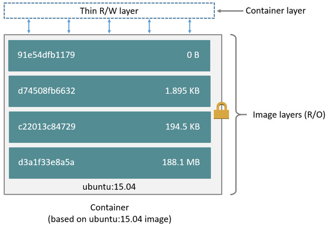

# Lab 02 - Creating and sharing your own container images

In this lab we will focus on container images.  We will learn what they are, where
to look for them and even explore the possibility of building our very own 
container images.

Container images are a series of read-only layers that are stacked on top of each
other to form a single unified view. The first image in the stack is called a
*base image* and all the other layers are stacked on top of this layer. The
diagram below shows the Ubuntu 15:04 image comprising 4 stacked image layers.


When you make a change to a container image, for example, adding a new file to
the Ubuntu 15.04 image, you add a new layer on top of the underlying image
stack. This change creates a new image layer containing the newly added file.
Each image layer has its own universal unique identifier (UUID) and each
successive image layer builds on top of the image layer below it.

Containers (in the storage context) are a combination of a container image with a
thin writable layer added to the top, known as the *container layer*.  The
diagram below shows the differnt layers of a container running the Ubuntu 15.04
image.

 

So the major difference between a container and an image is this writable layer.
All changes made to the container that adds new or modifies existing data are
stored in this writable layer. When the container is deleted the writable layer
is also deleted. The image remains unchanged. The container is hence immutable.

## Task 1: Searching for images

You can run containers from images that you built yourself or from images that
you pulled from a containers registry (all images from the previous lab were
pulled from the public container registry named Docker Hub). Docker Hub has
millions of images that are created and shared by regular users. Additionally,
Docker Hub hosts official images ( e.g Ubuntu, Redis, and Mongo) that are
created and maintained by their respective companies.

Issue the following commands and observe the output:

```
podman search ubuntu

---

trescst@Stevens-MBP lab-01 % podman search ubuntu
NAME                                      DESCRIPTION
docker.io/library/ubuntu                  Ubuntu is a Debian-based Linux operating sys...
docker.io/library/websphere-liberty       WebSphere Liberty multi-architecture images...
docker.io/library/open-liberty            Open Liberty multi-architecture images based...
docker.io/library/ubuntu-debootstrap      DEPRECATED; use "ubuntu" instead
docker.io/library/neurodebian             NeuroDebian provides neuroscience research s...
docker.io/library/ubuntu-upstart          DEPRECATED, as is Upstart (find other proces...
docker.io/ubuntu/nginx                    Nginx, a high-performance reverse proxy & we...
docker.io/ubuntu/cortex                   Cortex provides storage for Prometheus. Long...
docker.io/ubuntu/apache2                  Apache, a secure & extensible open-source HT...
docker.io/ubuntu/mysql                    MySQL open source fast, stable, multi-thread...
docker.io/ubuntu/bind9                    BIND 9 is a very flexible, full-featured DNS...
docker.io/ubuntu/squid                    Squid is a caching proxy for the Web. Long-t...
docker.io/ubuntu/prometheus               Prometheus is a systems and service monitori...
docker.io/ubuntu/redis                    Redis, an open source key-value store. Long-...
docker.io/ubuntu/postgres                 PostgreSQL is an open source object-relation...
docker.io/ubuntu/memcached                Memcached, in-memory keyvalue store for smal...
docker.io/ubuntu/grafana                  Grafana, a feature rich metrics dashboard &...
docker.io/ubuntu/prometheus-alertmanager  Alertmanager handles client alerts from Prom...
docker.io/ubuntu/telegraf                 Telegraf collects, processes, aggregates & w...
docker.io/ubuntu/cassandra                Cassandra, an open source NoSQL distributed...
docker.io/ubuntu/kafka                    Apache Kafka, a distributed event streaming...
docker.io/kasmweb/ubuntu-bionic-desktop   Ubuntu productivity desktop for Kasm Workspa...
docker.io/ubuntu/zookeeper                ZooKeeper maintains configuration informatio...
docker.io/ubuntu/loki                     Grafana Loki, a log aggregation system like...
docker.io/bitnami/ubuntu-base-buildpack   Ubuntu base compilation image
```

When you execute this command you will search Docker Hub for all images that
contain the word 'ubuntu' in them.

Alternatively you can search Docker Hub from the web by going to
https://hub.docker.com/.

## Task 2: Pulling images from a registry

Once you have identified an image you want to use you can `pull` it from the
registry.  Pulling an image means that you will download it to your local system
(laptop).

Use the command below to pull the `ubuntu` image:

```
podman image pull ubuntu 
```

Your output should be something like:

```
Trying to pull docker.io/library/ubuntu:latest...
Getting image source signatures
Copying blob sha256:125a6e411906fe6b0aaa50fc9d600bf6ff9bb11a8651727ce1ed482dc271c24c
Copying config sha256:d2e4e1f511320dfb2d0baff2468fcf0526998b73fe10c8890b4684bb7ef8290f
Writing manifest to image destination
Storing signatures
d2e4e1f511320dfb2d0baff2468fcf0526998b73fe10c8890b4684bb7ef8290f
```

To see which images you have pulled/cached locally issue the command below:

```
podman image ls
```

The output of the above command should look something like (pay special
attention to the `SIZE` of the images):

```
REPOSITORY                    TAG         IMAGE ID      CREATED      SIZE
docker.io/library/nginx       latest      7425d3a7c478  5 days ago   146 MB
docker.io/library/ubuntu      latest      d2e4e1f51132  2 weeks ago  80.3 MB
docker.io/gluobe/hello-world  latest      ac40b9130319  3 years ago  1.42 MB
```

In the above output you will also notice a `TAG` column, tags representspecific
versions of the image, if no tag is specified the 'latest' tag is being used.

```
podman image pull centos:6
podman image pull centos:7
```

> NOTE: the `latest` tag can often be confusing as there could be more recent
> images with a different tags, it is best-practice to always use a specific tag
> when working with container images

## Task 3: building your own container images (manual)

Container images are immutable by nature.  Most use-cases however require that you
make changes to the original image (also known as `base image`).  Some examples
are adding your own binaries/code or installinging dependencies into the image.

So how do you make changes to existing images (better known as building new
images)?  Doing it manually involves a couple of steps:

1. We start a container (non-interactive) from a base image (centos:7) and
install an additional package into the container, it is important that we give
the container a name as we will use the name as a reference in the next step:

```
podman container run --name centos_elinks centos:7 yum -y install elinks
```

2. Using the container name specified in the previous step we `commit` the
change into a new image:

```
podman container commit centos_elinks centos_elinks:7
```

To verify that the elinks package has indeed been installed on the new image,
simply run the following commands:

```
podman container run -ti centos:7 elinks
podman container run -ti centos_elinks:7 elinks
```

The first container should fail with the following error message: 
`executable file not found in $PATH`, the second container should work.

## Task 4: building your own container images (automated)

Obviously the manual procedure from the previous task is not something you want
to use when building a multitude of images.  What you would want instead is to
use is an automated procedure, and that is exactly what `Dockerfile` provides.

A Dockerfile is a text file that contains all the commands, in order, needed to
build a given image. A primary advantage of Dockerfile is version control and
documentation.

A Dockerfile details all the steps used to create a particular image.
Dockerfiles adhere to a specific format and require a specific instruction
syntax.

Some common commands used in Dockerfile are:
* `FROM` : sets the base image
* `RUN` : executes a command in the container
* `WORKDIR` : sets the working directory
* `EXPOSE` : exposes a port
* `CMD` : sets the executable for the container

Check the page below for the complete reference guide on Dockerfile:
https://docs.docker.com/engine/reference/builder/

Create (vim, nano, notepad.exe...) a file with the following content, and save it into your
current working directory with the name `Dockerfile` (important that you do not
specify a file extention):

```
FROM centos:7

RUN yum -y install elinks

CMD ["elinks"]
```

To build a new image using the above Dockerfile run the following command:

```
podman image build -t centos_elinks_dockerfile:7 .
```

> NOTE: the `.` at the end of the command is very important, it tells the build
> command to search for the `Dockerfile` in the current (`.`) directory

Test with:

```
podman container run -ti centos_elinks_dockerfile:7
```

## Task 5: pushing container images to a registry

A container registry is a repository where container images can be pulled from or
pushed to. In concept they are the same as Git repositories, only instead of
code you push/pull container images.

The most known container registry is the [Docker Hub](https://hub.docker.com),
think of it as the GitHub of container images.  But course there are many other
container repositories that you can use (GCR, ECR, Quay.io, Nexus, Artifactory,.. )

Just like with Git repositories, you can choose to make container images public or
private in the container registry.  Public images can be pulled by everybody (no
authentication/authorization required), private images require you to 
authenticate and that you have the necessary permissions.  To push, most container
registries require you to first authenticate.

To authenticate to the Docker Hub run the following command:

```
podman login
```

> NOTE: when you do not specifically specify a registry host, it will assume
> that you want to login into the default configured registry, in our case that is Docker Hub as we configured it in lab 00, should you want to login into
> a different registry simply add it to the command `podman login quay.io`

When you want to push images to the Docker Hub you will need te prefix your
image name with your Docker Hub username.  Again, this is similar to how
namespacing is handled on GitHub.

Because the Docker Hub username differs for everybody we will work with a
variable, this way you can keep copy/pasting the following commands:

```
export DOCKER_HUB_USERNAME=<YOUR_DOCKER_HUB_USERNAME>
```

Before we can push an image, we need to re-tag (rename) the image we created in
the previous task so it includes our username:

```
podman image tag centos_elinks_dockerfile:7 ${DOCKER_HUB_USERNAME}/centos_elinks_dockerfile:7
```

> NOTE: when you do not specifically specify a registry host, it will push the 
> image to the Docker Hub, should you want to push to a different registry,
> simply add it `podman tag centos_elinks_dockerfile:7 quay.io/${DOCKER_HUB_USERNAME}/centos_elinks_dockerfile:7`

You should see at least 2 images now when you run `podman images`, one
`${DOCKER_HUB_USERNAME}/centos_elinks_dockerfile:7>` and one `centos_elinks_dockerfile:7`:

```
REPOSITORY                         TAG                 IMAGE ID            CREATED             SIZE
trescst/centos_elinks_dockerfile   7                   1e9c0ff2dc02        3 hours ago         288MB
centos_elinks_dockerfile           7                   1e9c0ff2dc02        3 hours ago         288MB
```

To push the image to the Docker Hub run the following command:

```
podman image push --creds ${DOCKER_HUB_USERNAME} ${DOCKER_HUB_USERNAME}/centos_elinks_dockerfile:7
```

If you should see something like the output below:

```
Password: 
---
Getting image source signatures
Copying blob 3b8893993587 done  
Copying blob 174f56854903 done  
Copying config 67380c94ec done  
Writing manifest to image destination
Storing signatures

```

Now search for the image with the following command:

```
podman image search centos_elinks_dockerfile | grep ${DOCKER_HUB_USERNAME}

---

docker.io/trescst/centos_elinks_dockerfile
```

## Task 6: sharing images

The image you just pushed will be  public by default, so they can easily be
shared with your colleagues. So share your image name on Slack so your
colleagues can test your image (and you can test their image).

```
podman container run <COLLEAGUE_DOCKER_HUB_USERNAME>/centos_elinks_dockerfile:7
```

## Task 7: clean up

To clean up run the following commands:

```
podman system prune
unset DOCKER_HUB_USERNAME
```